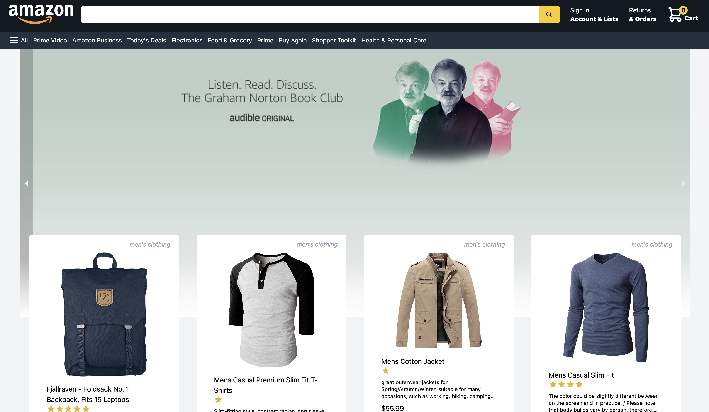

# Amazon Clone

This is the Amazon Clone - A massive e-commerce project that was built using [React.js](https://reactjs.org/) with [Next.js](https://nextjs.org/), [Javascript](https://www.ecma-international.org/), it also uses [TailwindCSS](https://tailwindcss.com/) to make this application look exactly like the real Amazon website, [Firebase](https://firebase.google.com) to manage Google Authentication, [Stripe](https://stripe.com/en-br) to manage payments through the web and [Redux Toolkit](https://redux-toolkit.js.org) to manage the state of our application so we can keep track of the changes of our application and have full control over it.

<p>&nbsp;</p>

<p align-items="center" justify-content="center">

</p>

<p>&nbsp;</p>

This amazon replica lists a lot of products that come from an API called [fakestoreapi](https://fakestoreapi.com), where the user, clients can see the products, their prices and ratings, as well as add or remove the products from the cart and later on they can use Stripe to pay for the products they want.

<p>&nbsp;</p>

This is a preview of the application

<br/>



<br/>

# Installation

After downloading you should install the missing packages and dependencies

using NPM:

```sh
npm install
```
using Yarn
```sh
yarn add
```
using PNPM:

```sh
pnpm install
```

<br/>

# Run the project in development environment

using NPM:

```sh
npm run dev
```
using Yarn
```sh
yarn dev
```
using PNPM
```sh
pnpm run dev
```
# Production Mode

The Production Version of the Amazon Clone is currently up and running on [Vercel](http://vercel.com) and can be seen if you click on the link: [Amazon Clone Production Vercel](https://amazon-clone-iota-seven.vercel.app)


# License
© Feito com muito &#10084; por [Ramon Pereira](https://www.linkedin.com/in/hugo-ramon-pereira/) 🇧🇷
